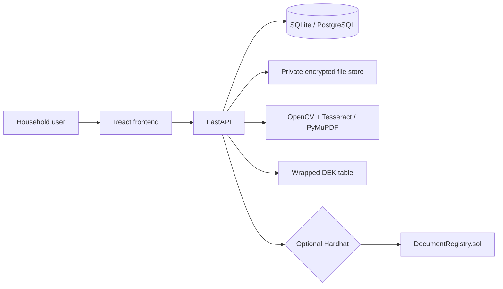

# DocNest architecture

```mermaid
flowchart LR
  User[Household user] --> UI[React frontend]
  UI --> API[FastAPI]
  API --> DB[(SQLite / PostgreSQL)]
  API --> FS[Private encrypted file store]
  API --> OCR[OpenCV + Tesseract / PyMuPDF]
  API --> KM[Wrapped DEK table]
  API --> Chain{Optional Hardhat}
  Chain --> SC[DocumentRegistry.sol]
```

The frontend never reads the private storage directory. All downloads are authorized API responses that decrypt in memory on the server.
