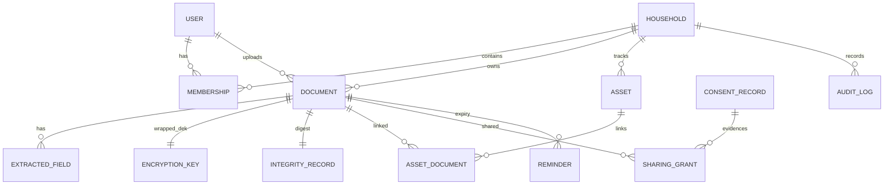

# Database ER diagram

```mermaid
erDiagram
  USER ||--o{ MEMBERSHIP : has
  HOUSEHOLD ||--o{ MEMBERSHIP : contains
  HOUSEHOLD ||--o{ DOCUMENT : owns
  USER ||--o{ DOCUMENT : uploads
  DOCUMENT ||--o{ EXTRACTED_FIELD : has
  DOCUMENT ||--|| ENCRYPTION_KEY : wrapped_dek
  DOCUMENT ||--|| INTEGRITY_RECORD : digest
  HOUSEHOLD ||--o{ ASSET : tracks
  ASSET ||--o{ ASSET_DOCUMENT : links
  DOCUMENT ||--o{ ASSET_DOCUMENT : linked
  DOCUMENT ||--o{ SHARING_GRANT : shared
  CONSENT_RECORD ||--o{ SHARING_GRANT : evidences
  HOUSEHOLD ||--o{ AUDIT_LOG : records
  DOCUMENT ||--o{ REMINDER : expiry
```
