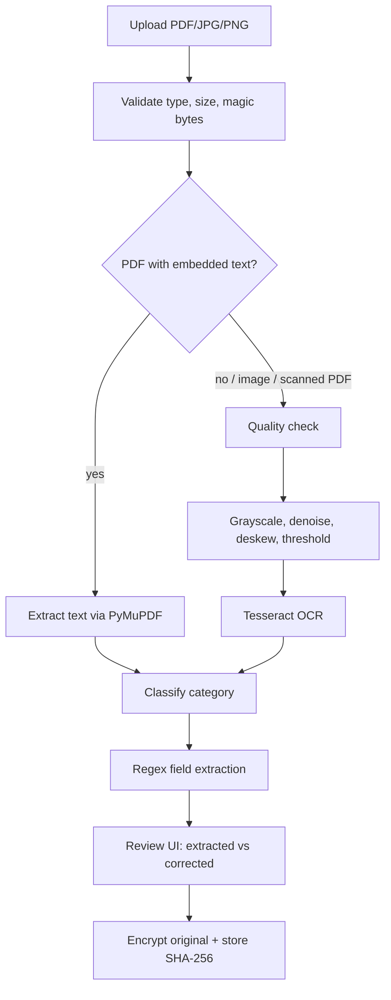

# OCR workflow

```mermaid
flowchart TD
  A[Upload PDF/JPG/PNG] --> B[Validate type, size, magic bytes]
  B --> C{PDF with embedded text?}
  C -->|yes| D[Extract text via PyMuPDF]
  C -->|no / image / scanned PDF| E[Quality check]
  E --> F[Grayscale, denoise, deskew, threshold]
  F --> G[Tesseract OCR]
  D --> H[Classify category]
  G --> H
  H --> I[Regex field extraction]
  I --> J[Review UI: extracted vs corrected]
  J --> K[Encrypt original + store SHA-256]
```

Uncertain values are left empty. The application does not invent missing identity numbers.
