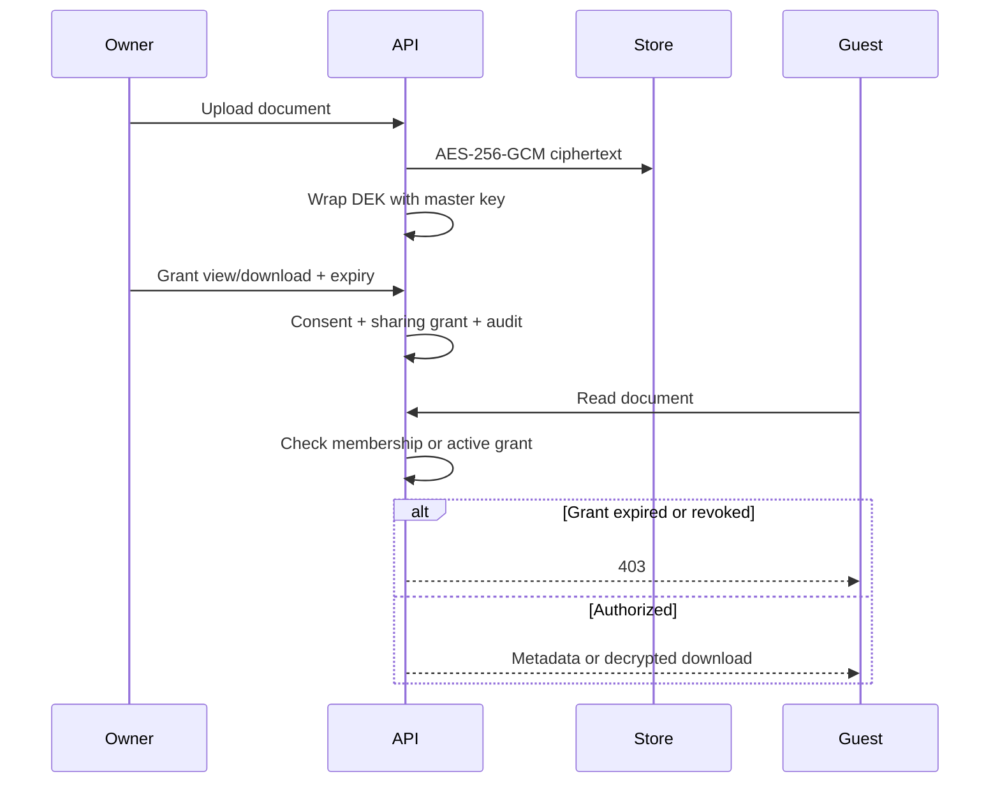

# Security and sharing workflow

```mermaid
sequenceDiagram
  participant Owner
  participant API
  participant Store
  participant Guest
  Owner->>API: Upload document
  API->>Store: AES-256-GCM ciphertext
  API->>API: Wrap DEK with master key
  Owner->>API: Grant view/download + expiry
  API->>API: Consent + sharing grant + audit
  Guest->>API: Read document
  API->>API: Check membership or active grant
  alt Grant expired or revoked
    API-->>Guest: 403
  else Authorized
    API-->>Guest: Metadata or decrypted download
  end
```

Authorization is enforced on every API call. Hiding buttons in the UI is not sufficient.
